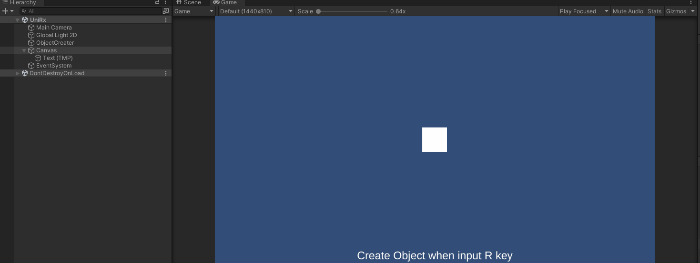

# Unity Object Pool Test vs UniRx Object Pool Test

Unity 2021から標準に追加されたObject PoolとUniRxのObject Poolの動作検証及び実装の比較

<!-- TOC -->
* [Unity Object Pool Test vs UniRx Object Pool Test](#unity-object-pool-test-vs-unirx-object-pool-test)
* [Demo](#demo)
  * [UniRxのObject Poolを使ったデモ](#unirxobject-pool)
* [requirements](#requirements)
* [references](#references)
<!-- TOC -->

# [Demo](https://ayutaz.github.io/UnityObjectPoolTest/WebGL/WebGL/)

## UniRxのObject Poolを使ったデモ

# requirements

* Unity 2021.3.4f1

# references

* [UniRxのObjectPoolを利用する](https://qiita.com/toRisouP/items/2a5fb86654525a4a8453)